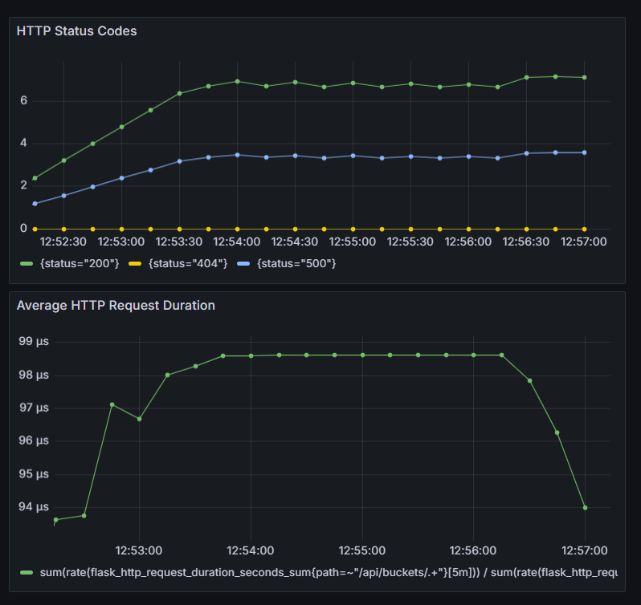

# SRE Instrumentation Challenge Implementation Explanation

## Step 1: Implementation 
- **Prometheus Metrics Endpoint**
  - Added a `/metrics` endpoint with `prometheus_flask_exporter` to meet the Prometheus metrics requirement.
  - **Why `prometheus_flask_exporter`?**
    - Since I’m new to Python (and Kubernetes), I chose the option that would save time and reduce the amount of new code I’d need to write or troubleshoot. `prometheus_flask_exporter` was designed for Flask and provided the metrics I needed, like request duration, method, and status code, right out of the box.
    - **Note**: Used it here for testing only, since the library’s version suggests it may not be ready for production.

- **Dockerfile for Storage API**
  - Created a Dockerfile with a lightweight Python base image, installed necessary dependencies, and exposed port `5000` for Prometheus compatibility.

- **Docker Compose Integration**
  - Added the Storage API as a service in `docker-compose.yml` and set the hostname to `storage_api` to ensure Prometheus could easily scrape metrics from `http://storage_api:5000`.

## Step 2: Visualization

- Created a new Grafana dashboard at [http://localhost:3000](http://localhost:3000) to visualize metrics from the Storage API. This was my first time using Grafana, but I found it intuitive.
- Configured the dashboard with the required graphs for request duration and status codes. Following the [prometheus_flask_exporter documentation](https://github.com/rycus86/prometheus_flask_exporter) helped streamline this setup.
- Considered automating the traffic generation script in a separate container to avoid running it manually each time, but I saved this for later to focus on finishing the main tasks.
- **Dashboard Example**:

   
- Exported the dashboard configuration as a JSON file to make reuse easy, which can be imported into Grafana as explained in the README.

## Step 3: Deployment

- Since I’m new to Kubernetes, I wanted a setup that didn’t require manually defining each resource. Initially, I thought I might need to write the configurations myself, but with more research, I realized most examples and guides recommend Helm for deploying Prometheus and Grafana. Using Helm seemed like the easiest, most reliable way to deploy these tools and I always try to avoid reinventing the wheel whenever possible.
- Since the Storage API is a custom application without an existing Helm chart, so I created `deployment.yaml` and `service.yaml` templates myself. This required mapping the configurations I used in Docker Compose over to Kubernetes, which wasn’t always straightforward.
- A significant challenge was adapting Prometheus and Grafana configuration files (like `prometheus.yml` and `datasources.yaml`) to find the corresponding keys in the chart values. 
- Since I used the official Prometheus Helm chart, it came with several additional components (like `node-exporter`, `kube-state-metrics`, `alertmanager`, and `pushgateway`) that weren't needed for this specific demo. To simplify the setup and reduce resource usage, I disabled these components.

# Potential Improvements Suggestions
- Use a more stable library for integrating Promethus with the Flask Storage API or implement our own metrics logic from scratch.
- Automate traffic generation by running the script **generate_traffic.sh** in a seperate container within Docker Compose and Kubernetes.
- Automate the import of an existing Grafana dashboard in both Docker Compose and Kubernetes by mounting the dashboard file as a volume.
- Deploy Prometheus and Grafana in seperate namespace(s).
- Declare and use a non root user in the docker file.

